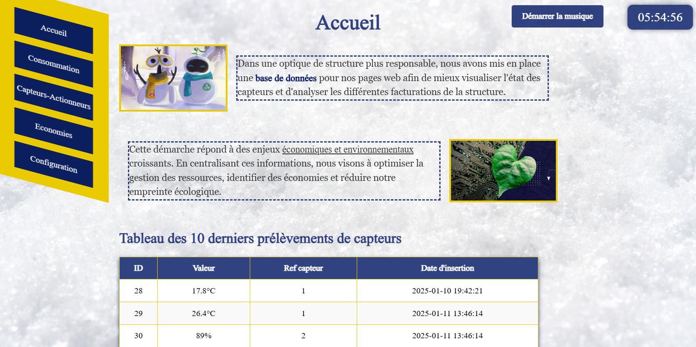

# Projet_Logement_Eco_Responsable_Base_de_donnees_FastAPI_RestServe_S7_Thibault

Projet de développement d'un serveur RESTful basé sur FastAPI, connecté à une base de données SQL pour la gestion, le traitement et le stockage des données. Le projet inclut une API REST permettant des interactions client/serveur, ainsi qu'un site web local développé en HTML/CSS/JavaScript pour une interface utilisateur intuitive.



## ⚙️​ Contenu du dépôt

Le dépôt est structuré comme suit :

+ 🗂️​ **[`Partie 1`](https://github.com/Vladislav-Levovitch-Polytech-Sorbonne/Projet_Logement_Eco_Responsable_Base_de_donnees_FastAPI_RestServe_S7_Thibault/tree/main/Partie%201%20-%20Base%20de%20donnee) - Base de donnee** : Contient les fichiers relatifs à la conception et au peuplement de la base de données SQL.

+ 🗂️​ **[`Partie 2`](https://github.com/Vladislav-Levovitch-Polytech-Sorbonne/Projet_Logement_Eco_Responsable_Base_de_donnees_FastAPI_RestServe_S7_Thibault/tree/main/Partie%202%20-%20Serveur%20RESTful) - Serveur RESTful** : Implémente un serveur RESTful en Python pour interagir avec la base de données.

+ 🗂️​ **[`Partie 3`](https://github.com/Vladislav-Levovitch-Polytech-Sorbonne/Projet_Logement_Eco_Responsable_Base_de_donnees_FastAPI_RestServe_S7_Thibault/tree/main/Partie%203%20-%20HTML%20CSS%20Javascript) - Intégration APIs externes** : Intégration d’APIs REST pour des données externes sous HTML5.

🗂️​ **`Ressources_utiles_utilisees`** : Contient des documents et références utilisés pour la réalisation du projet.

⚖️​ **`LICENSE`** : Licence publique du projet (GPL-3.0).

---

## 🎯 Instructions générales

### Partie 1 - Base de données
- Modélisation relationnelle d'une base de données pour gérer les données d’un logement (capteurs, mesures, factures, etc.).
- Fichier principal : **`logement.sql`**
  - Détruit, recrée et remplit les tables avec des données initiales.- 
**Remplissage automatisé :**
  - Le script **`remplissage.py`** permet de remplir et manipuler la base de données de manière automatisée. Il remplace efficacement la méthode manuelle en automatisant la création de nouvelles données et leur insertion dans la base, simplifiant ainsi les manipulations répétitives.

### Partie 2 - Serveur RESTful
- Développement d’un serveur RESTful en Python avec **FastAPI**.
- Fonctionnalités :
  - **GET** et **POST** : Consultation et ajout de données à la base via des requêtes HTTP.
  - Génération dynamique de pages HTML avec un graphique ( Google Charts ) pour visualiser la répartition des dépenses par domaine liées aux factures.
- Le serveur permet d'accéder et de modifier les données sans interaction directe avec la base SQL.

### Partie 3 - Site Web (HTML/CSS/JavaScript)
- Développement d'un site web permettant de gérer les fonctionnalités du logement éco-responsable. Le site respecte les principes du HTML5 et est conçu pour être totalement responsive, facilitant une utilisation fluide sur différents appareils.
- Fichier principal : **`index.html`**
  - Contient la structure de base du site, notamment le footer ( pieds de page ) et le lien vers les différents fichiers CSS pour les styles.
- **`Structure.css`** : Ce fichier centralise les styles généraux du site, comme les polices, les marges, et la configuration des éléments communs (par exemple, le menu de navigation ou le header ( en-tête )).
- Fichiers CSS spécifiques : Chaque page ( accueil, consommation, état des capteurs/actionneurs, économies réalisées, configuration) dispose d'un fichier CSS dédié pour gérer son design individuel.
---

## 🗝️​ Utilisation

1. **Installation des dépendances :**
    ```bash
    git clone https://github.com/Vladislav-Levovitch-Polytech-Sorbonne/Projet_Logement_Eco_Responsable_Base_de_donnees_FastAPI_RestServe_S7_Thibault.git
    cd Projet_Logement_Eco_Responsable_Base_de_donnees_FastAPI_RestServe_S7_Thibault
    python -m venv env
    source env/bin/activate
    pip install python==3.12.6
    pip install fastapi==0.115.4
    pip install uvicorn==0.32.0
    pip install pydantic==2.9.2
    pip install db-sqlite3==0.0.1
    sqlite3 Partie\ 1\ -\ Base\ de\ donnee/database.db < logement.sql

Le serveur est accessible à l'adresse : http://127.0.0.1:8000

Ressources internet utilisées :
https://fastapi.tiangolo.com/fr/tutorial/first-steps/
https://fastapi.tiangolo.com/fr/tutorial/query-params/#parametres-optionnels
https://www.w3schools.com/python/default.asp#gsc.tab=0&gsc.q=fastapi
https://www.w3schools.com/python/default.asp#gsc.tab=0&gsc.q=fastapi
https://chatgpt.com/

Remerciement pour le ReadMe source reutilisé : Ayoub LADJiCi et des fichiers de Daniel FERREIRA LARA 
Readapted with gpt

Aide rédactionnelle, au débogage, au code, soutien et remerciement : Daniel, Yulin, Maxime, Ayman, Victor, Quentin, Ayoub, Keryann, Nicolas, ChatGPT, HARIAN Elyoth, Benjamin et Thibault HILAIRE